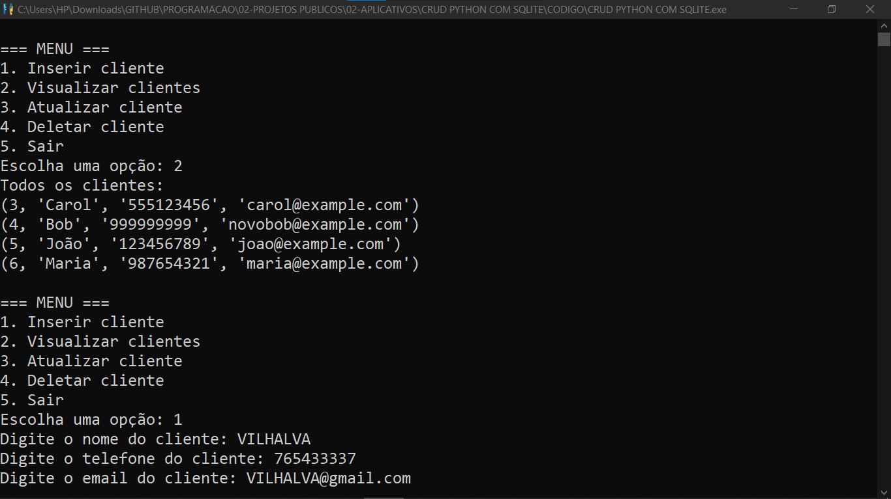
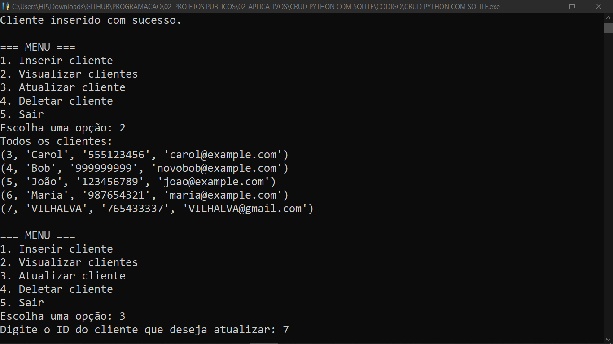
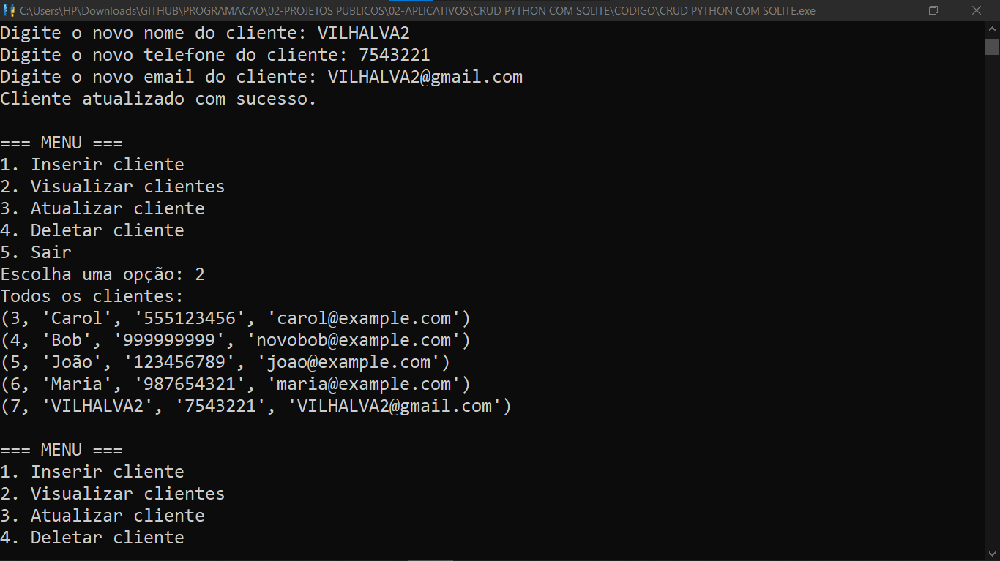
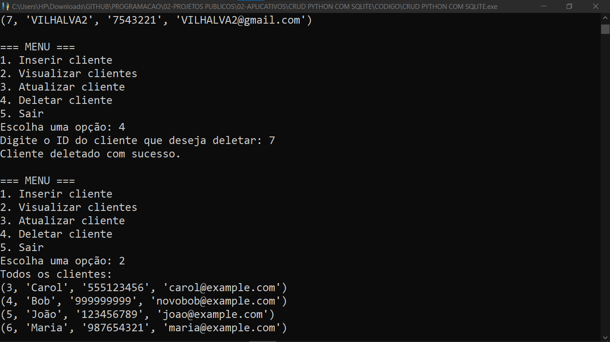

# CRUD PYTHON EM SQLITE
👨‍🏫PROJETO CRIADO PARA O CURSO DE PYTHON COM SQLITE.

 <br>
 <br>
 <br>
 <br>
 <br>

## DESCRIÇÃO:
Este script Python implementa um sistema simples de gerenciamento de clientes usando SQLite como banco de dados. Ele fornece funcionalidades básicas de CRUD (Create, Read, Update, Delete) para interagir com uma tabela de clientes em um banco de dados SQLite.

Este sistema é útil para demonstrar conceitos básicos de manipulação de banco de dados SQLite em Python e pode ser expandido para aplicativos mais complexos conforme necessário.

## RECURSOS:
1. **Conexão com o Banco de Dados:**
   - A função `conectar()` é responsável por conectar ao banco de dados SQLite. O arquivo do banco de dados é `"database.db"`.

2. **Criação da Tabela de Clientes:**
   - A função `criar_tabela()` cria a tabela de clientes se ela ainda não existir no banco de dados. A tabela possui os campos `id`, `nome`, `telefone` e `email`.

3. **Inserção de Cliente:**
   - A função `inserir_cliente()` permite adicionar um novo cliente ao sistema. Ela solicita nome, telefone e email do cliente, valida os campos e insere os dados na tabela.

4. **Visualização de Clientes:**
   - A função `visualizar_clientes()` exibe todos os clientes cadastrados no sistema, recuperando as informações da tabela de clientes.

5. **Atualização de Cliente:**
   - A função `atualizar_cliente()` permite atualizar as informações de um cliente existente. Solicita o ID do cliente, o novo nome, telefone e email, valida os campos e atualiza os dados na tabela.

6. **Exclusão de Cliente:**
   - A função `deletar_cliente()` permite excluir um cliente do sistema. Solicita o ID do cliente a ser excluído e remove as informações correspondentes da tabela.

7. **Menu de Opções:**
   - O script exibe um menu de opções numeradas onde o usuário pode escolher entre adicionar, visualizar, atualizar ou excluir clientes, além de sair do programa.

## EXECUTANDO O PROJETO:
1. **Executando** Para executar o arquivo Python, utilize o comando abaixo no terminal, dentro do diretório `./CODIGO`:

   ```
   python CODIGO.py
   ```

2. **Escolha uma opção** do menu digitando o número correspondente e pressionando Enter:
   - **Digite `1`** para inserir um novo cliente.
     - **Forneça o nome, telefone e email** do cliente quando solicitado.
   - **Digite `2`** para visualizar todos os clientes.
     - **Leia a lista de clientes** exibida no terminal.
   - **Digite `3`** para atualizar um cliente existente.
     - **Informe o ID do cliente** que deseja atualizar.
     - **Forneça o novo nome, telefone e email** para o cliente.
   - **Digite `4`** para deletar um cliente.
     - **Informe o ID do cliente** que deseja deletar.
   - **Digite `5`** para sair do aplicativo.

3. **Siga as instruções na tela** para cada operação.

4. **Repita as ações** conforme necessário até escolher sair.

## CREDITOS:
- [PROJETO CRIADO PARA CURSO DE PYTHON COM SQLITE](https://github.com/VILHALVA/CURSO-DE-PYTHON-COM-SQLITE)
- [PROJETO CRIADO PELO VILHALVA](https://github.com/VILHALVA)


